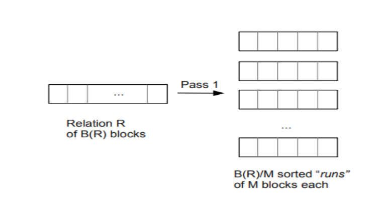
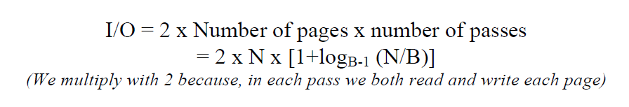
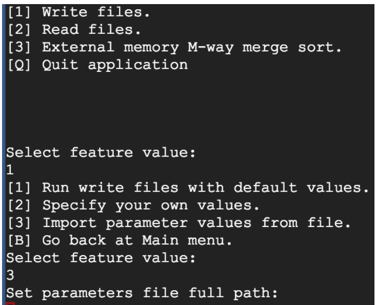

# Implementing external-memory merge-sort algorithm.

## Multiway-Merge-Sort Algorithm
Before explaining the algorithm, let us consider some generic terms first:

#### External memory algorithms:
These algorithms are used to process large data that doesn’t fit in main memory at once
at the same time. The data is generally stored in secondary devices. Then, chunks of
data (instead of the whole file at once) are brought into main memory, are processed
and then written back to the secondary memory.

#### External sorting algorithms:
These algorithms are a special version of external memory algorithms which are used to
sort data that doesn’t fit into main memory. These generally are of two types:
distributed sorting (Quick sort) and merge sorting. The running time of these algorithms
is calculated based on the number of passes between the external device or data source
and the main memory.

#### Multiway merge-sort Algorithm:
This is an external sorting algorithm and generally consists of two phases: sort and
merge. In the sorting phase, the whole data is divided into lists/chunks that are small
enough to fit into the main memory (ideally equal to the available applicable memory
space) and are sorted using any in-memory algorithms, like for example quicksort. After
sorting they are written back to the disk. This process is repeated until the file is divided
in B(R)/M sorted chunks that were written to disk, where B(R) refers to the number of
blocks of relation R and M to the available memory as depicted in the figure below.

  

To sort a file in multiway merge-sorting with N pages and B buffers, the number of
passes to merge all the data will be logB-1 (N/B). We consider only (B-1) buffers
because we need one buffer for the output. As we require one pass to read all the data
and split it into sorted chunks (pass 0), the total number of passes for multi-way external
merge sort is 1+(logB-1 (N/B)) (Always consider upper bound). [7]
The total I/O cost are therefore:

  

#### Advantages:
It is obvious that the less number of disk I/O we need to perform, the faster the
algorithm will be. In a 2-way merge sort algorithm, many intermediate files will be
created which we need to flush out and read in again. This is significantly increasing the
disk I/O operations and thus affecting the time. With k-way merge sort, if the number of
files, n is less than k, then there will be 0 intermediate files. And when n>k, we only
need to perform merge sort n/k number of times.

#### Disadvantages:
Though k-way merge sort performs better in terms of I/O operations, it is very complex
to implement as it requires the usage of heaps or other similar data structures for
efficient time complexity.

In the merging phase, the data from the sorted lists is read into main memory and the
first integers of the respective files are merged using a d-way merge technique, where d
is the number of streams that are merged at once. The outcome, a sorted list of data, is
written back to disk. With every iteration the length of the sorted file is multiplied by
M. This process is repeated until all chunks are merged and only one completely sorted
file is left.

## Testing Application Development

We created separate classes for read and write streams to make the code easier to read
and conceptually clearer. To have a more generic programming approach we created 2
interfaces “ReadStream” and “WriteStream” in which the generic methods are declared
that will be used in all the stream classes. Based on the project requirements we created
the requested methods and added a few extra ones to support our application
development. The generic methods declared in the interfaces are explained below. In
each of the subsequent sections we will then emphasise the differences for specific
streams.

#### ReadStream interface
• void OpenFile() – Method used to open the files for read.
• int ReadNext – Method used to return the next integer read from the files.
• boolean EndOfStream – Method to check if we reached the end of the file. We
try to read the next integer every time we check for the end of the file.
• boolean IsOpen – Method used to check if the stream is still open before trying
to manipulate it.
• void Close() – Method used to close the streams. It is very important to release
the used memory.

#### WriteStream interface
• void CreateFile() – Method used to create the new files while using write
streams.
• void WriteElement() - Method used to write an integer to the stream.
• boolean IsOpen() – Method used to check if the stream is still open before trying
to manipulate it.
• void Close() – Method used to close the streams. It is very important to release
the used memory.

## Application interface
To make the testing as convenient as possible, we developed a command line
application interface for the performance testing, which is named DSA.jar in our
submission. The following steps describe the process for executing the application in
Linux. Other operating systems might have slightly different commands.

To run the testing, navigate to the folder where the DSA.jar file is saved and execute the
command: java -jar DSA.jar in the command utility. The application now
prompts the four options shown in Figure. Enter 1 to open a write stream, 2 for a read
stream, 3 for an external multiway merge-sort algorithm or Q to close the application.

  

For more details please refer to the project [report](report/Project_Report_DSA.pdf). 